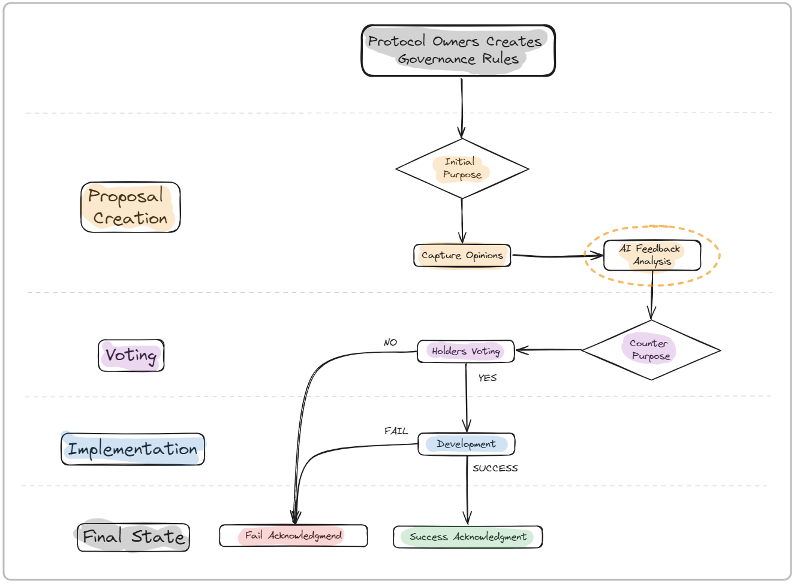

# SlothGov: AI Powered Governance for Web3

## Overview

SlothGov is an innovative platform that revolutionizes governance within web3 protocols by empowering protocol owners to create and manage governance tokens. Central to SlothGov's approach is leveraging advanced Language Learning Models (LLMs) to synthesize community feedback into refined, actionable proposals. This system not only democratizes the governance process but also ensures that every stakeholder's voice can contribute to the protocol's evolution.

## Key Features
* **Configurable Governance Setup:** Protocol owners can tailor the governance experience, including who can initiate proposals, the LLM model used for processing feedback, adjust the feedback period, etc
* **Selective Proposal Creation:** SlothGov allows protocol owners to determine whether certain token holders can initiate proposals, offering a customizable approach to governance based on the protocol's policies.
* **AI-Driven Comment Selection:** Utilize AI to filter and elevate the most relevant community comments, ensuring a focus on constructive feedback.
* **LLM-Enhanced Proposals:** Employ pre-trained LLMs to assimilate key insights from community feedback into proposals, fostering a more inclusive and representative final proposition.
* **Decentralized Voting Mechanism:** A transparent and equitable voting process where token weight influences outcomes, alongside a customizable quorum requirement for proposal passage.
* **Community-Powered Audit System:** Post-implementation, the community can audit the success of proposals, ensuring adherence to the voted mandates and enhancing accountability.

## Flowchart
This is how the application works.
1. **Governance Configuration:** Protocols establish their governance framework on SlothGov, setting parameters such as proposal initiation rights and feedback mechanisms. 

2. **Proposal Initiation:** Within the configured governance framework, eligible participants submit initial proposals.

3. **Community Engagement:** Token holders provide feedback within the customized timeframe set by the protocol.

4. **AI Filtering:** Relevant feedback is identified through AI, ensuring the proposal refinement process is focused and effective.

5. **LLM Proposal Refinement:** A new, integrated proposal is crafted, reflecting the community's consensus and suggestions.

6. **Voting Period:** Token holders vote, with decisions influenced by token weight and a pre-defined quorum for passage.

7. **Implementation and Community Audit:** Successful proposals are implemented, with a subsequent community audit phase to evaluate adherence to the original proposal and overall success.

8. **Take a look on this Flowchart representation:**

## Requirements
Make sure you have the following installed:

- [Node (>= v18.17)](https://nodejs.org/en/download/)
- Yarn ([v1](https://classic.yarnpkg.com/en/docs/install/) or [v2+](https://yarnpkg.com/getting-started/install))
- [Git](https://git-scm.com/downloads)
- ...

## Getting Started
### Front-end 
1. `cd frontend`
2. `npm install`
3. Set the envoriment variables `NEXT_PUBLIC_CHAIN_ID`, `WEB3_HOST_PROVIDER`
4. npm run dev
### Back-end 
1. `cd backend`
2. `npm install`
3. Set the envoriment variables that connect to the cloudinary database and openAi API, `OPENAI_API_KEY`, `CLOUDINARY_API_KEY`, `CLOUDINARY_API_SECRET`.
4. `node index`
### Contracts
1. `cd contracts`
2. `npm install`
3. Set your the DEPLOY_INFURA_KEY and PRIVATE_KEY variables
4. `npx hardhat run --network aurora ./scripts/deployAurora.ts`
5. `npx hardhat run --network mumbai ./scripts/deployMumbai.ts`

## Usage
1. **Wallet Connection:** Start by connecting your wallet to SlothGov to engage with the platform.
2. **Proposal Interaction:** Depending on the governance configuration, engage with proposals either by initiating them or providing feedback.
3. **Vote and Audit:** Participate in the voting process and, post-implementation, contribute to the community audit to ensure transparency and accountability.

## Team:
[cauemguimaraes](https://github.com/cauemguimaraes)
[DannxC](https://github.com/DannxC)
[Ferroca2](https://github.com/Ferroca2)
[Rafael450](https://github.com/Rafael450)